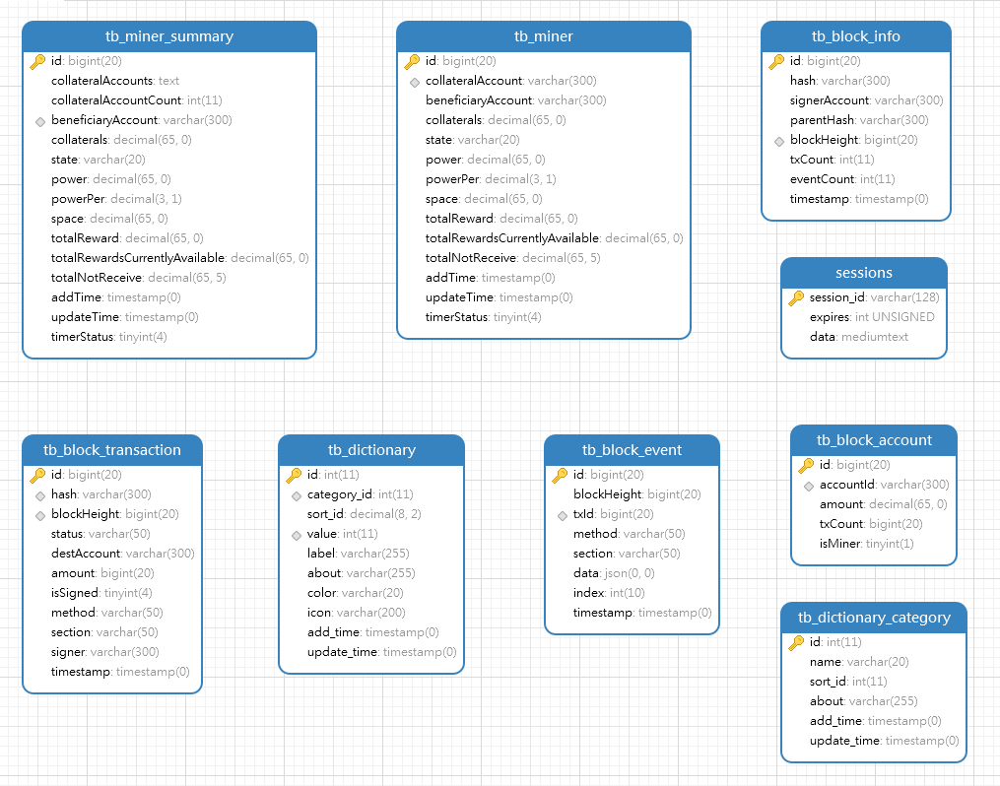

# 数据库结构

数据库用于存储链上数据，包括了区块详细信息、交易信息、Event信息、Account列表、矿工列表以及交易状态字典。

## 如何导入

使用Mysql管理工具链接你的数据库引擎，然后执行本目录下的 [database-init.sql](database-init.sql) 文件即可导入一个完整数据库。

> 注：数据库引擎版本建议使用 mysql-v5.7

成功导入后，会自动创建一个名为【substats-w3f】的数据库，在这个数据库你将会看到8张表，结构如下图：

## 数据表作用说明

### tb_block_account

链上账号列表

### tb_block_event

区块Event列表

### tb_block_info

区块信息列表，包含区块高度，Hash,交易数量，时间等信息

### tb_block_transaction

区块里面的交易信息列表，包括了所在的区块/交易Hash/交易状态/方法/签名者等

### tb_dictionary

状态字典表，用于存储交易状态对应的序号的key-value数据字典

### tb_dictionary_category

状态字典分类表

### tb_miner

矿工列表，从链上实时同步下来的全部矿工列表

### tb_miner_summary

矿工算力汇总表

