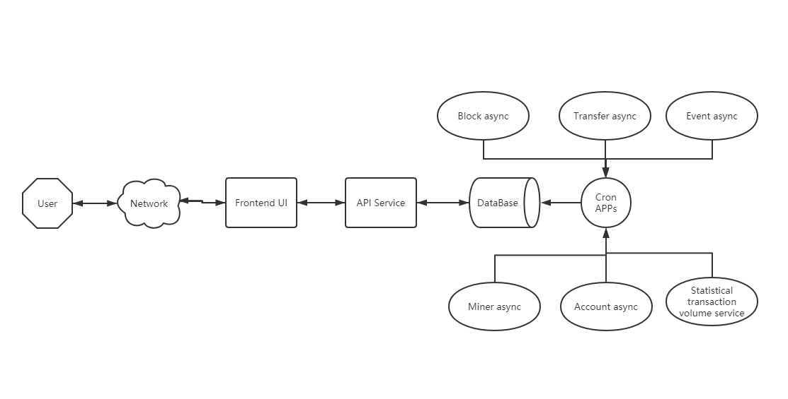

# About the framework

## 主要构成

系统主要分成三大部分：

- 定时任务服务
- 后端API服务
- 前端UI渲染

定时任务服务负责从链上获取数据，然后加工处理并保存到数据库中，后端API服务负责把数据聚合后发送给前端进行展示。为什么要把数据同步到数据库？这是由于链提供的是最基础的API，无法完全满足对数据查询业务的需要，比如：想要查询一个Account所有的历史交易记录，或者通过交易哈希查询一笔交易的状态，就无法通过链的API直接查询得到，如果把区块数据全部同步到本地数据库，就可以通过聚合完成这些查询。

## 介绍

### 1. 定时任务服务

定时任务是基于Node.js开发的针对调度程序，主要功能为实时同步链上数据到数据库，使用 [polkadot.js](https://polkadot.js.org/docs/) 连接链RPC接口，通过对数据读取、加工整理后存入数据库。

包括以下定时服务
- 区块同步服务
- 交易记录同步服务
- Events同步服务
- 矿工列表同步服务
- Account列表同步服务
- 交易量统计服务

API服务程序位于 /app 目录下

技术栈如下：

- Node.js
- Polkadot.js
- Mysql
- ORM

### 后端API服务

API服务是基于Node.js开发的web服务端系统，主要功能是为前端提供HTTP和Websocket接口，用于数据查询、数据处理、区块更新等。包括：
- 区块链桥接器
- 数据库连接器
- HTTP web服务
- Websocket服务

API服务程序位于根目录下

技术栈如下：

- Node.js
- Server:Express websocket
- Database:Mysql
- Polkadot
- Jest

### 前端UI系统

前端UI系统主要功能是读取后台API服务的数据并进行渲染与展示，使用Ract.js前端框架和Antd UI组件库

API服务程序位于 /ui 目录下

技术栈如下：

- React
- Ant-design
- Ant-design/charts
- React-router-dom
- Styled-components
- Reduxjs/toolkit
- craco

